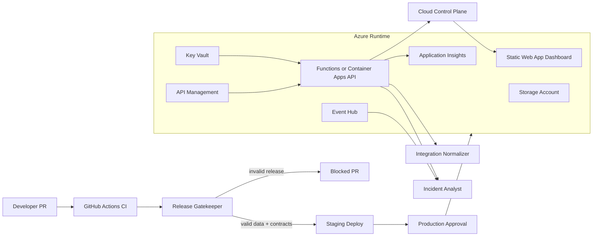

# Prometheus

[](https://github.com/OWNER/REPO/actions/workflows/ci.yml)
[](https://github.com/OWNER/REPO/actions/workflows/deploy.yml)

Prometheus is an AI-powered Azure DevOps platform that prevents bad releases, broken API contracts, and production incidents.

It is a portfolio project for DevOps Engineer, Cloud Engineer, and Junior Platform Engineer roles. It combines CI/CD gates, Azure infrastructure, observability, security controls, and AI-assisted operational workflows in one deployable platform.

> This project is not related to the CNCF Prometheus monitoring system.

## What It Proves

- **CI/CD engineering:** pull request gates, test automation, security scans, staging deploys, and production approvals.
- **Cloud engineering:** Azure Static Web Apps, Azure Functions/Container Apps, Storage, Event Hub, Key Vault, Application Insights, and API Management.
- **Platform engineering:** reusable release gates for data quality, API contracts, and production debugging.
- **DevSecOps:** secret management, dependency auditing, RBAC-style API authorization, and audit logging.
- **Observability:** deployment health, validation metrics, incident analysis, and alert-ready telemetry.

## Architecture



## Modules

### Release Gatekeeper

Blocks bad releases before they reach production.

- Validates JSON payloads against required fields and ranges.
- Runs API contract tests on pull requests.
- Produces machine-readable validation results for CI.

### Integration Normalizer

Standardizes third-party API payloads into one internal contract.

- Converts vendor-specific keys into canonical fields.
- Flags unknown vendor formats.
- Keeps API integrations testable and repeatable.

### Incident Analyst

Analyzes production-style logs and suggests root cause.

- Groups incident events by severity.
- Detects likely root causes from log patterns.
- Emits remediation hints for dashboard and alerts.

### Cloud Control Plane

Shows operational health across releases and runtime.

- Deployment health.
- Validation failure rate.
- API normalization errors.
- Incident volume.
- Audit events.

## Local Demo

Run the dashboard:

```bash
npm run dev
```

Then open `http://localhost:4173`. If that port is already busy, run with another port:

```bash
PORT=4174 npm run dev
```

Use the dashboard controls to test the dynamic page:

- Click **Run Release** to move the pipeline, update release confidence, and add live stream events.
- Click **Live Mode On/Off** to pause or resume simulated telemetry.
- Click module cards or the **All / Risk / Incidents** filter to change the inspector panel.

Run all quality gates:

```bash
npm test
```

Run a CI-style validation pass:

```bash
npm run ci:local
```

Run the intentionally failing sample:

```bash
npm run demo:blocked-release
```

## CI/CD

The CI workflow runs on pull requests and pushes:

- Unit tests.
- Data validation tests.
- API contract tests.
- Incident analysis tests.
- Dependency audit.
- Terraform format/validation checks.

The deploy workflow models a real Azure release:

- Deploys infrastructure to staging.
- Deploys app artifacts to staging.
- Requires a production environment approval before production deployment.

## Azure Resources

Terraform provisions:

- Resource group.
- Storage account.
- Event Hub namespace and hub.
- Key Vault.
- Log Analytics workspace.
- Application Insights.
- Azure Static Web Apps placeholder resource.
- Azure API Management service.

## Repository Layout

```text
.
├── .github/workflows/      # CI and deployment automation
├── infra/terraform/        # Azure Infrastructure as Code
├── public/                 # Static dashboard
├── src/                    # Platform modules
├── tests/                  # Node test suite and fixtures
└── scripts/                # Local CI/demo scripts
```

## Resume Line

Built **Prometheus**, an AI-powered Azure DevOps platform with GitHub Actions CI/CD, Terraform-managed Azure infrastructure, release validation gates, API contract normalization, production log analysis, and observability dashboards.
